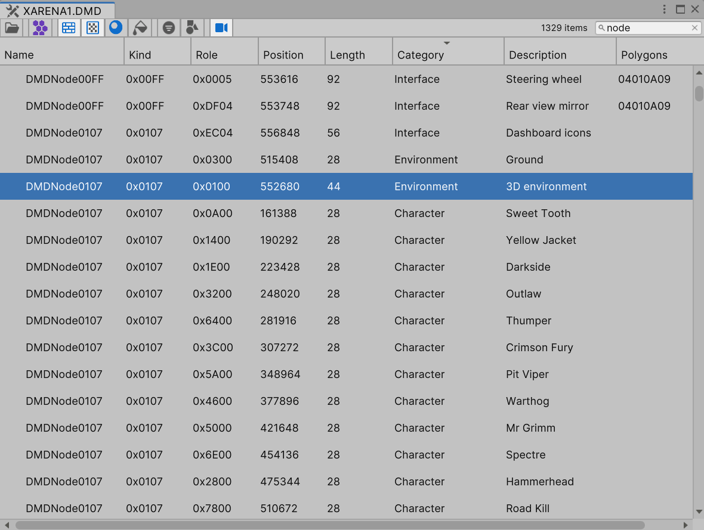
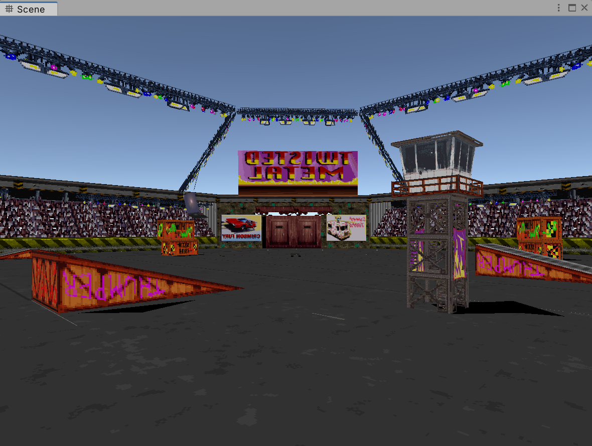
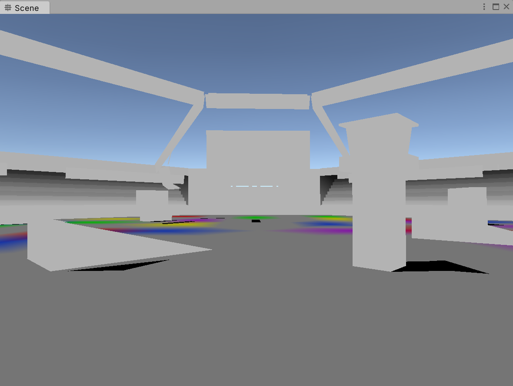
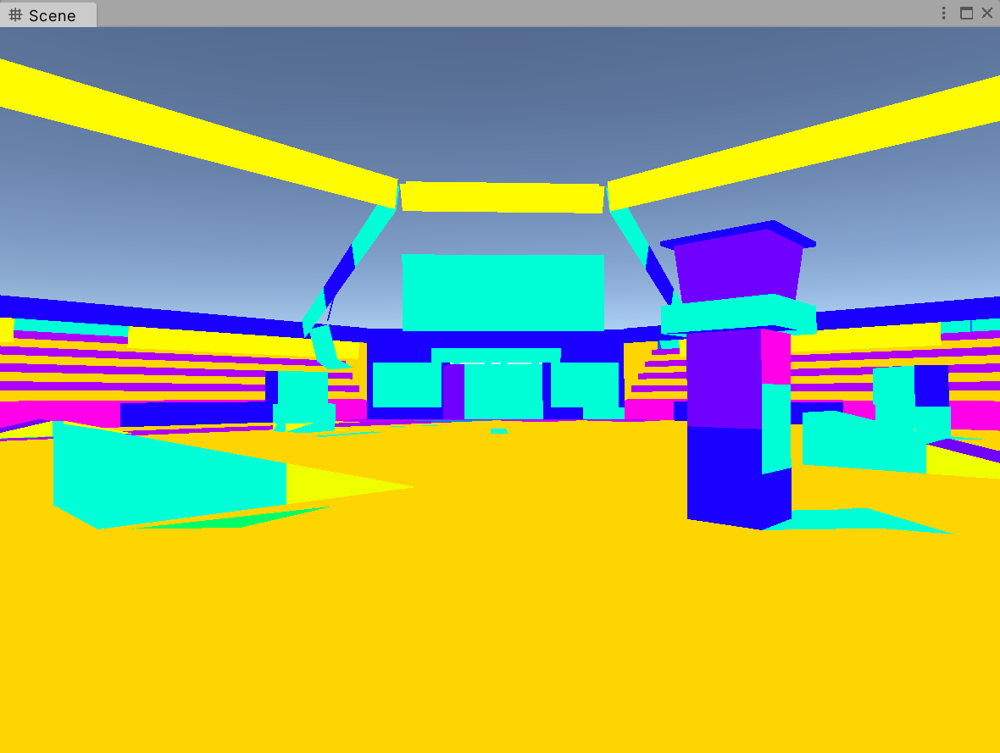
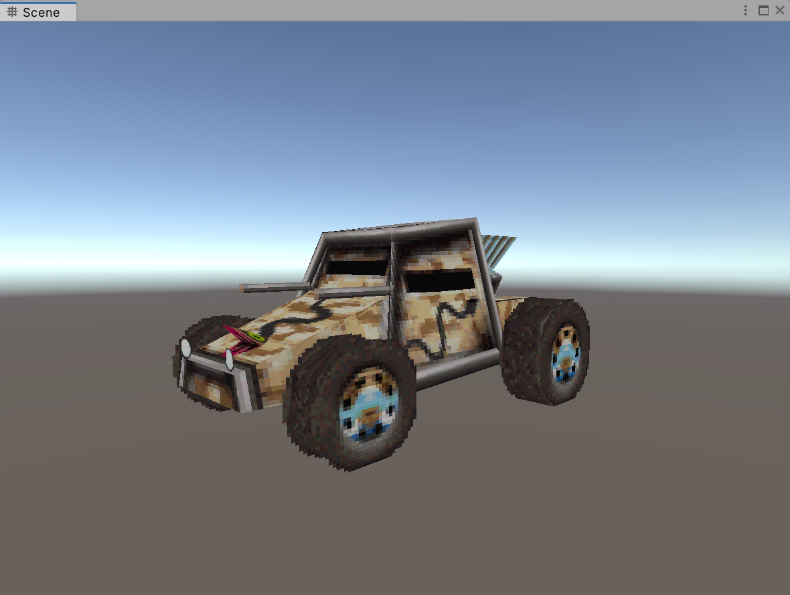
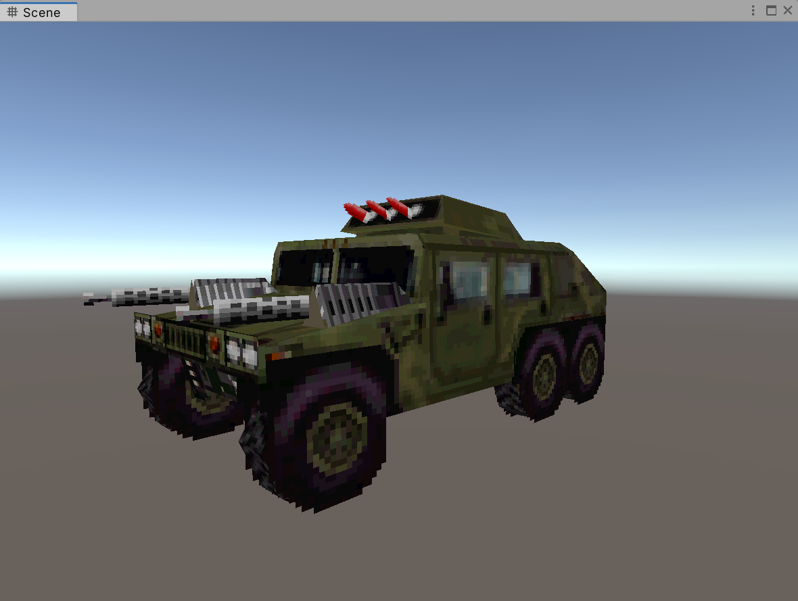
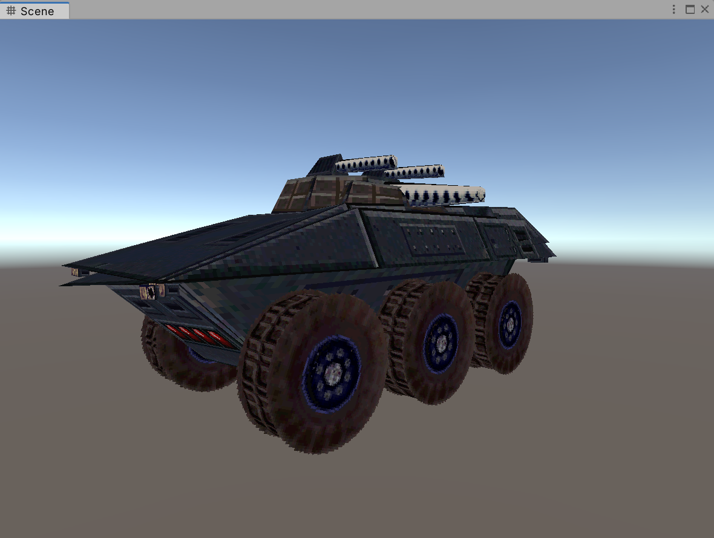
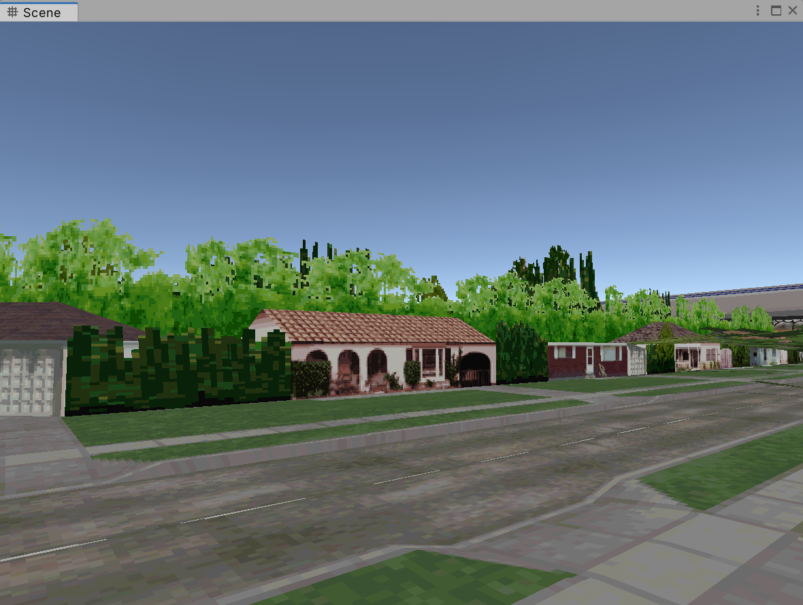
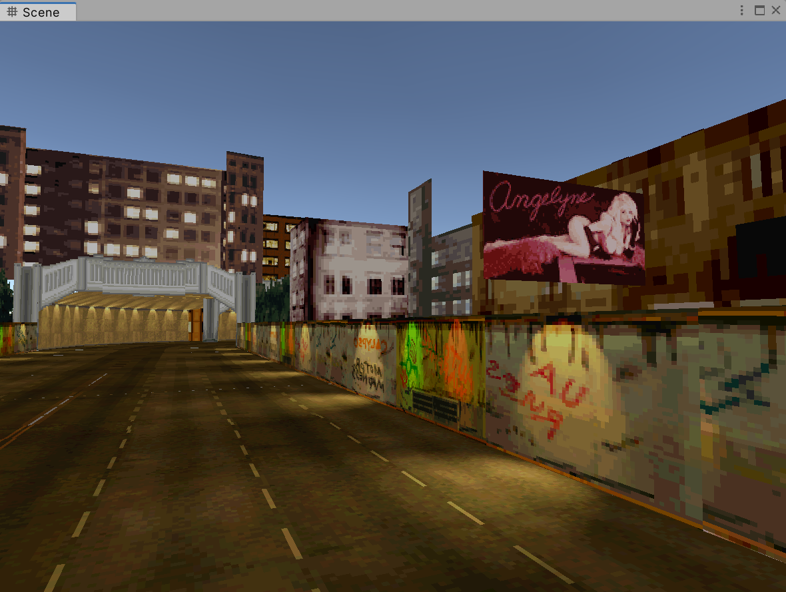
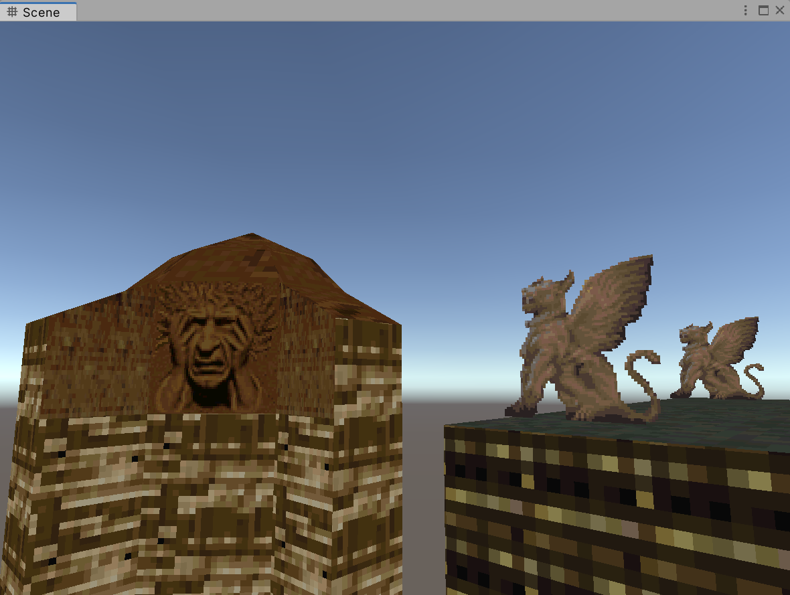

# Twisted

Reverse-engineering of Twisted Metal, a game released on the PlayStation in 1995.

# Table of Contents

- [Twisted](#twisted)
- [Table of Contents](#table-of-contents)
- [Getting started](#getting-started)
- [Using the database viewer](#using-the-database-viewer)
  - [The toolbar](#the-toolbar)
  - [The database view](#the-database-view)
  - [The database columns](#the-database-columns)
- [Reverse-engineering](#reverse-engineering)
  - [The database](#the-database)
  - [The symbols](#the-symbols)
  - [Tips and tricks](#tips-and-tricks)
- [Known issues](#known-issues)
  - [Unity](#unity)
  - [Project](#project)
- [Gallery](#gallery)

# Getting started

To use this project, you will need the following:

- [Unity 2022.1.0b16](https://unity3d.com/beta/2022.1b#downloads) or later as the project uses the latest UI elements

- Twisted Metal, you can use demo files from [*UK PlayStation Magazine 4 CD*](https://github.com/aybe/Twisted/releases/tag/twisted)

# Using the database viewer

The database viewer allows you to explore levels of the game, you can launch it from the _Twisted_ menu.

## The toolbar

***Open an existing database:***

Every database has an associated texture atlas, make sure that both are in the same directory.

***Enable polygon-level generation:***

Generates one game object per polygon, this is quite slow but allows for a detailed inspection.

***Enable texture:***

Objects without texture will most likely need to have vertex color enabled to look as intended.

***Enable transparency:***

Objects with transparency will most likely need to have this setting enabled to look as intended.

***Enable vertex color:***

Pretty much all objects in the game will require this setting to be enabled to look as intended.

***Enable polygon color:***

Tints every polygon family with a distinct color, useful to highlight usage of a specific polygon family.

***Enable hierarchy filtering:***

Filters out the generated hierarchy, only including objects tagged as being part of the environment.

***Enable search filtering:***

Filters out the nodes shown in the list while searching the database, only including distinct nodes.

***Enable selection framing:***

Enabling this setting will automatically frame the generated hierarchy of objects in the scene view.

***Number of visible nodes:***

Indicates how many nodes are currently shown in the tree or in the filtered list during a search.

***Search field:***

Filters out the database to show nodes containing entered text, regular expressions are supported.

## The database view

The content is shown as a tree view that switches to a list view while performing a search.

Multi-column sort can be done by holding <kbd>Ctrl</kbd> or <kbd>Shift</kbd> key to add or remove a column.

Database nodes have a context menu from which you can perform some actions on them.

## The database columns

***Name:***

The name of the class that implements the node.

***Kind:***

The major type for the node, categorizes nodes by their purpose in the database.

***Role:***

The minor type for the node, categorizes nodes by their purpose in the scene.

***Position:***

The position of the node in the database file.

***Length:***

The length of the node in the database file.

***Category:***

This is a human-friendly representation of the *Role* column, indicates major role in scene.

***Description:***

This is a human-friendly representation of the *Role* column, indicates minor role in scene.

***Polygons:***

Indicates what family of polygons are referenced by the database node.

# Reverse-engineering

## The database

The DMD format is a hierarchical data structure that consists of nodes with different kind and role.

It appears to be a rough variation of the HMD format that can be found in the official PlayStation SDK.

Everything in the database is referred to by an offset to a base pointer specified at the top of the file.

The nodes themselves are intertwined with model data throughout the file and in no particular order.

## The symbols

These can be found in the PSX.SYM file and they do match against the executable SIPS_600.07.

Obviously, knowing this information is extremely useful in further understanding the game!

Ghidra and IDA users can generate a script to perform batch renaming using [dumpsym](https://github.com/aybe/dumpsym).

## Tips and tricks

From the *Twisted* menu, you can batch extract the nodes and polygons for an easier analysis.

You are likely to hack onto the game at some point, try [no$psx](https://problemkaputt.de/psx.htm) with its amazing debugger.

You may also like [nocash-GPU-command-prettifier](https://github.com/aybe/nocash-GPU-command-prettifier) and [nocash-GPU-texture-calculator](https://github.com/aybe/nocash-GPU-texture-calculator).

Here are a couple of useful patches to apply to the game:

Address|Value|Result
-|-|-
8011A270|(DWORD)(0)|Suppresses enemy movement
801196FC|(DWORD)(0)|Suppresses enemy weaponry
800FF634|(DWORD)(0)|Suppresses head-up display

# Known issues

## Unity

**Progress bars may occasionally not reach 100%:**

This is because Unity progress bar are incredibly slow at catching updates.

**Focused control may occasionally lose focus after typing:**

This happens throughout Unity when there are UI elements at play.

**Tree view is partially redrawn after clicking a column header:**

This is a bug in Unity's tree view.

**Recursively expanding a tree view item using selects the item:**

This is a bug in Unity's tree view.

**Tree view items cannot be fully revealed using keyboard navigation:**

This is a bug in Unity's tree view.

## Project

**Maximizing a scene view while the viewer is open clears the hierarchy:**

Editor windows get destroyed during this event, currently this isn't handled.

**Rendering a database in its entirety produces wrong textures:**

There is colliding texture information in the game data.

**Scene hierarchy is not updated by viewer after switching to play mode:**

This has to be investigated, for now, close it and open it again to fix the issue.

**Sprites are completely wrong:**

They require a special type of node that isn't implemented at the moment.

**Wrong colors in some regions:**

Extra lighting is involved in the game but it hasn't been figured out yet.

**Wrong textures in some regions:**

There is incorrect texture information in some of the polygons.

**Wrong transforms for some objects:**

The game performs extra transformations at runtime.

**Wrong transparency for some objects:**

Correct transparency among families of polygons has yet to be implemented.

**Z-fighting:**

Either some objects are at the same position or required ordering tables are missing.

# Gallery

